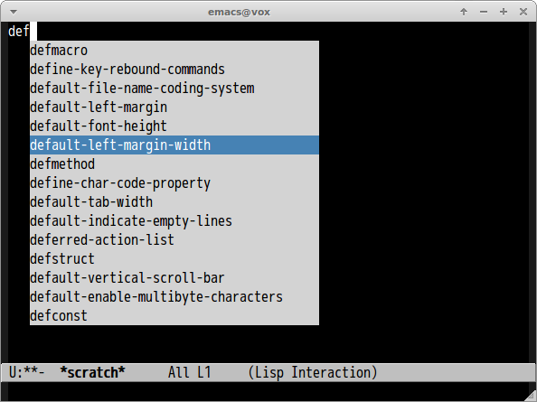

# popup-complete [![melpa badge][melpa-badge]][melpa-link] [![melpa stable badge][melpa-stable-badge]][melpa-stable-link]

Packaging [these code snippets](http://www.emacswiki.org/emacs/PopUp) by created LinhDang.

## Screenshot




## Requirements

- [popup-el](https://github.com/auto-complete/popup-el/)


## Customization

#### `popup-complete-enable`(Default is `t`)

Use popup completion if this variable is non-nil.

#### `popup-complete-enabled-modes`(Default is `nil`)

Major modes which enables `popup-complete`


## Sample Configuration

```lisp
;; Enables only 'lisp-interaction-mode' 'ruby-mode' 'scala-mode'
(custom-set-variables
 '(popup-complete-enabled-modes '(lisp-interaction-mode ruby-mode scala-mode)))
```

[melpa-link]: http://melpa.org/#/popup-complete
[melpa-stable-link]: http://stable.melpa.org/#/popup-complete
[melpa-badge]: http://melpa.org/packages/popup-complete-badge.svg
[melpa-stable-badge]: http://stable.melpa.org/packages/popup-complete-badge.svg
